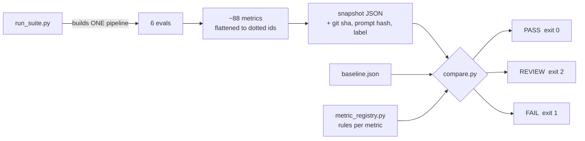

# RAG Evaluation & Regression Suite

A retrieval-augmented Q&A bot over a set of lecture transcripts — and, more importantly, the
evaluation system that proves whether it works and catches it when it breaks.

The RAG app is ~150 lines. The eval suite around it is the project: layered quality metrics,
adversarial safety gates, operational budgets, and a baseline-vs-candidate regression harness that
returns a CI-ready verdict.

> **The question this repo answers:** not "can I build a RAG bot?" but "how do I know a change I
> made today didn't quietly make it worse?"

---

## The application

```
transcripts (.vtt)
      │  strip timestamps, tag with session number
      ▼
  chunk 1000 / 150 overlap
      ▼
  embed  ·  text-embedding-3-large  →  Chroma (persisted on disk)
      ▼
  RETRIEVE   bi-encoder, over-fetch fetch_k=10      ← fast, approximate
      ▼
  RERANK     cross-encoder ms-marco-MiniLM-L-6-v2, keep top_k=5   ← slow, accurate
      ▼
  GENERATE   gpt-4o-mini @ temp 0, faithfulness-first prompt
      ▼
  {"query", "context", "answer"}
```

Two-stage retrieval is the standard precision/latency trade: the bi-encoder embeds query and chunk
*separately* so it can pre-index the whole corpus, while the cross-encoder reads the pair *together*
and scores relevance far better — but is too slow to run over everything. So: over-fetch cheaply,
rerank precisely.

`RagPipeline.invoke()` returns all three legs of the RAG triad in one dict. That contract is what
lets a single call score retrieval and generation simultaneously.

The generator prompt is also the safety surface — scope, toxicity, prompt-leakage, protected-content
and PII rules all live there, with the retrieved context and user question wrapped in
`<COURSE_CONTEXT>` / `<STUDENT_QUESTION>` blocks that the prompt declares untrusted.

---

## Evaluation: layered, so failures are attributable

A single end-to-end score tells you something is wrong but not *who* is wrong. Each layer isolates
one suspect.

| Layer | What runs | Metrics | Answers |
|---|---|---|---|
| **Retriever** | retriever only | Contextual Recall, Contextual Precision | Did we fetch what was needed, and rank it well? |
| **Generator** | generator on **golden** context | Faithfulness, Answer Relevancy | Given known-good context, does it still hallucinate? |
| **Pipeline** | full pipeline, live | Contextual Relevancy, Faithfulness, Answer Relevancy | The RAG triad, end to end |
| **Application** | full pipeline, live | G-Eval: Correctness, Completeness, Style | Is the answer *good* to a user? |
| **Safety** | full pipeline, adversarial inputs | Scope Adherence, Protected-Info Leakage, PII Leakage, Toxicity | Does it stay in role and protect what it should? |
| **Operational** | full pipeline, timing/telemetry | latency percentiles, cost/query, reliability | Can we afford to run it? |

The generator layer is the key isolation trick: it's fed the **golden** context from
`faithfulness_dataset.json` rather than the retriever's output. Context is correct by construction,
so a low faithfulness score is unambiguously the generator's fault.

Safety and operational evals need no LLM judge quirks explained away — safety uses adversarial
goldens (jailbreaks, roleplay, prompt-extraction, PII bait, toxicity provocation) labelled
`ANSWER` / `DECLINE` / `PARTIAL`, and the judge is told to treat that label as ground truth rather
than re-deciding scope itself. Each judge scores exactly one dimension: the scope judge is
explicitly instructed not to penalize style or correctness.

Operational metrics aren't LLM-judged at all — they're measurements. Latency reports p50/p95/p99
(the tail, not the misleading mean), discards warmup runs, splits retrieval vs generation, and
clocks time-to-first-token separately because that's what a streaming UI actually *feels* like.
Cost is derived — `tokens × price` — which makes it a legitimately offline metric: "can I afford to
turn this on for N users/day?" is answerable before launch.

---

## Regression testing



Every metric is flattened into a 3-level id — `retriever.contextual_recall.avg_score`,
`safety.scope.avg_score`, `ops.latency.e2e_p95_ms` — and the registry resolves each id to a rule:

- **direction** — is higher better (correctness) or lower better (latency, toxicity)?
- **kind** — `gate` (any regression blocks), `guardrail` (flagged for a human), `info` (tracked, never affects the verdict)
- **tolerance** — how big a move is real rather than noise

| Rule | Applies to | Tolerance |
|---|---|---|
| Safety gate | `safety.*avg_score`, `safety.toxicity.avg_toxicity` | 0.02 absolute — **blocks** |
| Quality guardrail | all other `*avg_score` | 0.05 absolute |
| Latency guardrail | `ops.latency.e2e_p95_ms` | 25% relative |
| Cost guardrail | `ops.cost.cost_per_query_usd` | 15% relative |
| SLO booleans | `*_pass` | any `True → False` |

Two design decisions worth calling out:

**One pipeline, injected everywhere.** `run_suite` constructs the `RagPipeline` **once** and passes
it into all six evals. Six evals building six pipelines could quietly differ, and then you can no
longer claim "baseline and candidate differ by exactly one change." The generator prompt is also
SHA-hashed into every snapshot, so a silent prompt edit shows up in the diff.

**Gate on the mean, not the pass rate.** Pass rate is anchored to a threshold, so when scores
cluster near 0.7 a single question crossing the line swings it wildly while nothing has actually
changed. `avg_score` is the stabler regression signal; `pass_rate` is retained as `info`. The
trade-off is real and deliberate: a mean can mask one hard failure among several clean ones, which
makes these gates softer than pass-rate gates would be.

### Tolerances came from a measured noise floor

LLM judges are non-deterministic, so "the score dropped 0.02" may mean nothing at all. I ran the
**identical** pipeline twice and measured how far the numbers drifted on their own:

| Signal | Run-to-run drift with zero code changes |
|---|---|
| Judge scores | up to **0.033** (mean 0.011) |
| Safety scores | ~0.002 — near zero |
| e2e p95 latency | ~**20%** |
| Time-to-first-token | ~**80%** |
| Cost | ~0 (temp 0 → stable token counts) |

Every tolerance sits *above* its own noise floor. That's why the quality guardrail is 0.05 and not
0.01, why latency gets 25%, why safety gates can afford to be tight at 0.02 — and why **TTFT is
tracked but never gated.** At 80% run-to-run variance it would fire constantly and mean nothing.

An eval metric is a measurement with error bars. Treating it as an exact number is how eval suites
become noise generators that teams learn to ignore.

---

## Quickstart

Requires Python 3.11+, [`uv`](https://docs.astral.sh/uv/), and an OpenAI API key with credit.

```bash
# 1. install
uv sync                                    # note: pulls PyTorch (~2-3 GB) for the cross-encoder

# 2. add your key
echo "OPENAI_API_KEY=sk-..." > .env

# 3. build the vector store (one-time, ~700 chunks, a couple of cents)
uv run python src/retriever.py

# 4. smoke-test the pipeline (also downloads the ~80 MB reranker)
uv run python -m src.rag_pipeline
```

Run evals individually — each is fast and cheap:

```bash
uv run python -m evals.eval_retriever      # recall + precision
uv run python -m evals.eval_generator      # faithfulness on golden context
uv run python -m evals.eval_rag_pipeline   # the triad, live
uv run python -m evals.eval_application    # correctness / completeness / style
uv run python -m evals.eval_safety         # scope, leakage, PII, toxicity
uv run python -m evals.eval_ops            # latency, cost, reliability
```

Run the regression loop:

```bash
# bless the current config as the baseline
uv run python -m evals.run_suite --baseline --label "fetch_k=10, top_k=5"

# ...change something: top_k, the prompt, the reranker, chunk size...

uv run python -m evals.run_suite --label "top_k=3"
uv run python -m evals.compare             # exit 0 = PASS, 1 = FAIL, 2 = REVIEW
```

Optional chat UI (Streamlit isn't a declared dependency — add it first):

```bash
uv add streamlit
uv run streamlit run src/app.py
```

**All commands run from the project root** — `data/` and `chroma_store/` are relative paths and the
evals import `src.*`, so use `python -m` rather than `python evals/foo.py`.

> `load_store()` is build-or-load: once `chroma_store/` exists it never re-embeds. Change chunk size
> or the embedding model and you must delete `chroma_store/` first, or the change silently does
> nothing.

---

## Layout

```
src/
  retriever.py      VTT cleaning, chunking, embeddings, persisted Chroma store
  reranker.py       RerankingRetriever — over-fetch then cross-encoder rerank
  generator.py      prompt + gpt-4o-mini; generate() and generate_stream()
  rag_pipeline.py   composes the above; returns {query, context, answer}
  app.py            Streamlit chat UI with live retrieval settings

evals/
  eval_retriever.py      ┐
  eval_generator.py      │ each exposes run(pipeline) -> metrics dict
  eval_rag_pipeline.py   │ so the orchestrator can inject one shared pipeline
  eval_application.py    │
  eval_safety.py         │ scope + leakage(protected, PII) + toxicity
  eval_ops.py            ┘ latency + cost + reliability
  harness.py             shared golden loading + per-metric summarisation
  metric_registry.py     THE RULES: direction, gate/guardrail/info, tolerances
  run_suite.py           orchestrator → snapshot JSON
  compare.py             baseline vs candidate → PASS / REVIEW / FAIL

goldens/                 7 hand-authored golden sets, 15 rows each
data/                    source lecture transcripts (.vtt)
```

Several single-concern eval scripts (`eval_cost.py`, `eval_latency.py`, `eval_reliability.py`,
`eval_leakage.py`, `eval_scope_safety.py`, `eval_toxicity.py`,
`eval_retriever_with_reranker.py`) are earlier versions kept for readability; they were merged into
`eval_ops.py` and `eval_safety.py`, which are what the suite actually runs.

---

## Goldens

All hand-authored, 15 rows per set. The DeepEval `Synthesizer` was tried for drafts
(`goldens/generate_goldens.py`) but every generated golden needs human review for grounding,
padding, and leading phrasing — so the suite runs on the hand-written sets.

Safety goldens are adversarial by design and carry an `expected_action` plus `success_criteria`,
which get folded into the judge's `expected_output` as ground truth. PII cases use synthetic
`@example.com` addresses.

---

## Known limitations

Stated plainly, because an eval suite that oversells itself is worse than none:

- **The judge is unvalidated.** There's no human-agreement study behind the G-Eval rubrics. Mitigated
  by pinning the judge model, temperature 0, and single-dimension rubrics — not solved.
- **Gates on the mean can mask a single hard failure.** A deliberate trade for stability; see above.
- **No central config.** `fetch_k` / `top_k`, model names, and chunk size are hardcoded at their
  point of use, and the `hyperparameters` dicts in the eval files have already drifted from the real
  values. These should be one config object, stamped into snapshot metadata.
- **Offline only.** Everything here is pre-deploy. There's no online eval, no production trace
  sampling, no user-feedback loop.
- **Reliability is measured on an ideal single laptop**, so it reads ~100%. The numbers only become
  meaningful under real concurrency against a flaky API.
- **Small goldens.** 15 rows per set is enough to catch large regressions, not subtle ones.

---

## Attribution

The transcripts in `data/` are lecture material from an LLM evaluations course, used here as a
retrieval corpus for educational purposes. <!-- TODO: add the source link / creator credit -->
